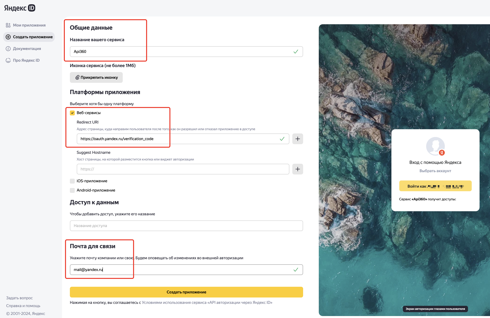
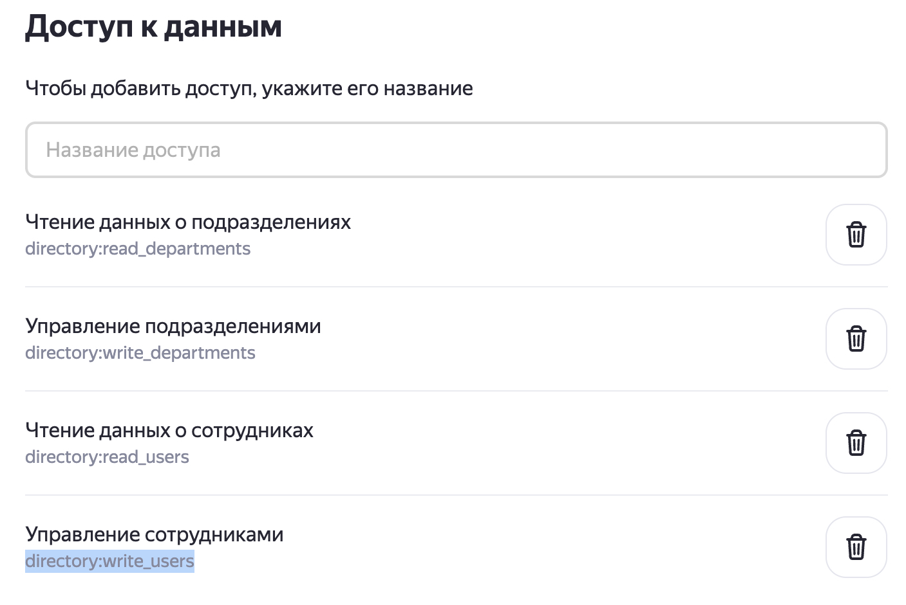
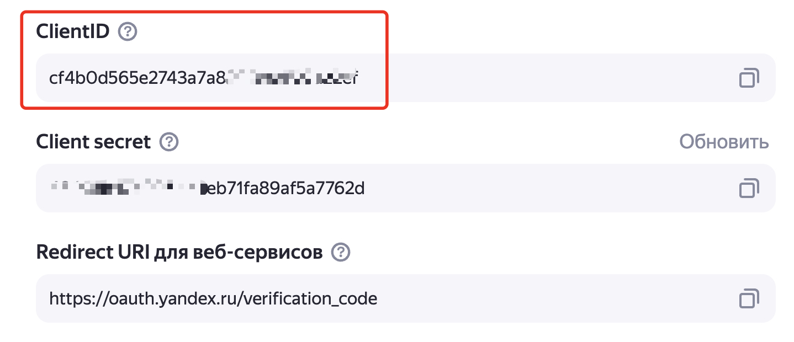
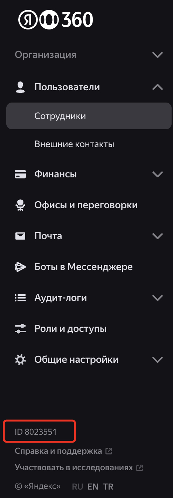

# Синхронизация департаментов пользователей между Active Directory и Yandex 360

## Обзор

Скрипт `sync_deps_for_users.py` предназначен для синхронизации информации о департаментах пользователей между Active Directory (AD) и Yandex 360. Он извлекает данные о пользователях и их департаментах из AD через LDAP, сравнивает их с департаментами в Yandex 360 и обновляет данные в Yandex 360, если необходимо. Скрипт поддерживает режим "сухого прогона" (`DRY_RUN`) для тестирования без внесения изменений.

## Логика работы

1. **Чтение данных из Active Directory**:
   - Подключается к AD через LDAP, используя параметры из файла `.env_ldap` (хост, порт, учётная запись, базовый DN, фильтр поиска).
   - Запрашивает атрибуты пользователей (`mail`, `department`, `company`) для пользователей, соответствующих фильтру (например, членов группы `Yandex360`).
   - Формирует словарь `{alias: "департамент (компания)"}` для пользователей с непустыми `mail`, `department`.
   - Сохраняет результаты в CSV-файл, если указан `OUT_FILE`.

2. **Получение данных из Yandex 360**:
   - Использует API Yandex 360 для получения списка департаментов и пользователей.
   - Формирует словарь департаментов `{id: название}` и словарь пользователей `{alias: departmentId}`.

3. **Сравнение и синхронизация**:
   - Сравнивает список департаментов из AD с департаментами в Yandex 360.
   - Добавляет новые департаменты из AD в Yandex 360 (если они отсутствуют), если `DRY_RUN=false`.
   - Для каждого пользователя в Yandex 360 проверяет, совпадает ли его департамент с данными из AD:
     - Если департамент отличается, обновляет `departmentId` пользователя в Yandex 360 через API (если `DRY_RUN=false`).
     - Если департамент в AD пустой, переводит пользователя в корневой департамент (`departmentId=1`).
   - Проверяет псевдонимы (aliases) пользователей, если их основной email отсутствует в AD, и синхронизирует департаменты по псевдониму.

4. **Логирование**:
   - Логирует операции в консоль (уровень INFO) и в файл `sync_deps.log` (уровень DEBUG).
   - Ротация логов происходит при достижении 10 МБ, хранится до 20 резервных копий.

## Параметры

Скрипт использует переменные окружения, задаваемые в файле `.env_ldap` в каталоге скрипта или непосредственно в окружении:

| Имя параметра         | Описание                                                                 | Обязательный | Пример значения                                    |
|-----------------------|--------------------------------------------------------------------------|--------------|---------------------------------------------------|
| `token`        | OAuth-токен для аутентификации в API Yandex 360.                         | Да           | `y0_AgAAAA...`                                   |
| `orgId`               | Идентификатор организации в Yandex 360 (целочисленный).                  | Да           | `123456`                                          |
| `LDAP_HOST`           | Адрес контроллера домена (DNS-имя или IP).                               | Да           | `dc01.contoso.com`                                |
| `LDAP_PORT`           | TCP-порт LDAP (389 для LDAP, 3268 для глобального каталога).             | Да           | `3268`                                            |
| `LDAP_USER`           | Учётная запись для подключения к LDAP (формат: `domain\user`).           | Да           | `contoso\ldap_connector`                          |
| `LDAP_PASSWORD`       | Пароль учётной записи LDAP.                                              | Да           | `password`                                        |
| `LDAP_BASE_DN`        | Базовый DN для поиска пользователей в AD.                                | Да           | `OU=Office,DC=contoso,DC=com`                     |
| `LDAP_SEARCH_FILTER`  | Фильтр поиска пользователей в AD.                                        | Да           | `(memberOf=CN=Yandex360,OU=Groups,OU=Office,DC=contoso,DC=com)` |
| `ATTRIB_LIST`         | Список атрибутов для извлечения из AD (через запятую).                   | Да           | `distinguishedName,mail,displayName,department,company` |
| `OUT_FILE`            | Имя файла для сохранения результатов LDAP-запроса (CSV).                 | Нет          | `ad_users.csv`                                    |
| `DRY_RUN`             | Режим "сухого прогона" (`true` для имитации, `false` для изменений).     | Нет (по умолчанию `false`) | `true` или `false` |

### Примечания к параметрам
- **Обязательные параметры**: Все, кроме `OUT_FILE` и `DRY_RUN`, должны быть заданы. При их отсутствии скрипт завершится с ошибкой.
- **LDAP_HOST**: Для нескольких доменов в AD требуется DNS-имя и настройка DNS-разрешения. Для одного домена можно указать IP.
- **ATTRIB_LIST**: Должен включать как минимум `mail`, `department`, `company` для корректной работы.
- **DRY_RUN**: Если `true`, скрипт только логирует предполагаемые изменения без их применения.
- **Файл `.env_ldap`**: Пример:
  ```
  token=y0_AgAAAA...
  orgId=123456
  LDAP_HOST=dc01.contoso.com
  LDAP_PORT=3268
  LDAP_USER=contoso\ldap_connector
  LDAP_PASSWORD=password
  LDAP_BASE_DN=OU=Office,DC=contoso,DC=com
  LDAP_SEARCH_FILTER=(memberOf=CN=Yandex360,OU=Groups,OU=Office,DC=contoso,DC=com)
  ATTRIB_LIST=distinguishedName,mail,displayName,department,company
  OUT_FILE=ad_users.csv
  DRY_RUN=false
  ```

## Подготовка.
### Получение OAuth токена.

Создать OAuth токен для аутентификации в API Яндекс 360. Токен должен содержать необходимые права для выполения операций управления ресурсами в организации Яндекс 360. Документация - [Создание приложения](https://yandex.ru/dev/id/doc/ru/register-client). Последовательность шагов для создания токена:
* заходим на https://oauth.yandex.ru/client/new/. Аутентифицируемся от имени администратора организации Яндекс 360.
* Заполняем поля в форме создания приложения:
        - Поле "Название вашего сервиса" - произвольное название.
        - Включаем галочку "Веб сервисы"
        - В поле `Redirect URL` вводим `https://oauth.yandex.ru/verification_code`
        - В разделе "Почта для связи" указываем свой email.


        
* Добавляем разрешения для токена. Для этого в разделе "Доступ к данным" ищем и добавляем следующие разрешения:

| Имя разрешения | Что можно делать |
|----------------|----------|
| directory:read_departments | читать информацию о  подразделениях |
| directory:write_departments | изменять информацию о подразделениях |
| directory:read_users |  читать информацию о пользователях |
| directory:write_users | изменять информацию о пользователях |
        

        
* нажимаем на кнопку "Создать приложение".
* Свойства созданного приложения отображаются в новом окне "Мои приложения". Ищем раздел с идентификатором созданного приложения и копируем строку из поля "ClientID":
      

        
* В текстовом редакторе созадем строку вида `https://oauth.yandex.ru/authorize?response_type=token&client_id=<идентификатор приложения>` и вставляем в ней вместо `<идентификатор приложения>` скопированное значение ClientID из предыдущего пункта. 
Вставляем получившуюся ссылку в браузер и нажимаем "Enter".
* В окне браузера появляется запрос на подтверждение прав токена. Подтверждение **необходимо выполнить от учётной записи администратора организации** (если это сделать от имени обычного пользователя, то токен не получит затребованных прав из-за отсутствия необходимых разрешений у данной пользовательской учётной записи).
Нажимаем "Войти как" и получаем необходимый токен доступа. 


> [!NOTE]
> Полученный токен необходимо указать в файле .env_ldap в качестве значения параметра `token`

### Получение ID организации Яндекас 360

Для этого необходимо зайти в [консоль администрирования](admin.yandex.ru) и в левом нижнем углу интерфейса будет необходимый номер.
   


> [!NOTE]
> ID организации необходимо указать в файле .env_ldap в качестве значения параметра `orgId`
        
## Установка

1. **Установите Python**: Требуется Python 3.7 или выше.
2. **Установите зависимости**:
   Скрипт требует библиотеки:
   - `python-dotenv`: Для загрузки переменных окружения.
   - `ldap3`: Для работы с LDAP.
   - `requests`: Для запросов к API Yandex 360 (предполагается, что используется в `API360`).

   Установите их с помощью:
   ```bash
   pip install python-dotenv ldap3 requests aiohttp
   ```

3. **Настройте окружение**:
   - Создайте файл `.env_ldap` в каталоге скрипта с параметрами (см. пример выше).
   - Убедитесь, что у вас есть действующий OAuth-токен для Yandex 360, ID организации и учётная запись LDAP с правами чтения AD.

## Запуск

1. **Подготовка**:
   - Поместите скрипт `sync_deps_for_users.py` в рабочий каталог.
   - Создайте и заполните файл `.env_ldap` или задайте переменные окружения.
   - Убедитесь, что файл `lib/y360_api/api_script.py` с классом `API360` доступен.

2. **Запуск скрипта**:
   ```bash
   python sync_deps_for_users.py
   ```
   Скрипт:
   - Подключится к AD и Yandex 360.
   - Сравнит департаменты и обновит данные в Yandex 360 (если `DRY_RUN=false`).
   - Запишет результаты в лог `sync_deps.log` и, если указан `OUT_FILE`, в CSV-файл.

3. **Режим сухого прогона**:
   - Установите `DRY_RUN=true` в `.env_ldap` для тестирования без изменений:
     ```bash
     export DRY_RUN=true
     python sync_deps_for_users.py
     ```

4. **Пример работы**:
   - Скрипт извлечёт пользователей из AD, например, `{ "user_alias": "IT (Contoso Inc)" }`.
   - Проверит департаменты в Yandex 360, добавит отсутствующие (например, "IT (Contoso Inc)").
   - Обновит `departmentId` для пользователей, чьи департаменты не совпадают, или переместит в корневой департамент, если `department` пустой.

## Логирование

- **Консоль**: Сообщения уровня INFO (например, `2023-10-01 12:00:00.123 INFO: Получен список пользователей AD: 50`).
- **Файл**: Сообщения уровня DEBUG записываются в `sync_deps.log`, ротация при 10 МБ (20 копий).
- Формат: `%(asctime)s.%(msecs)03d %(levelname)s:\t%(message)s` с датой `ГГГГ-ММ-ДД ЧЧ:ММ:СС`.

## Обработка ошибок

- **LDAP-ошибки**: Ошибки подключения или поиска логируются, скрипт завершается.
- **API-ошибки**: Предполагается, что `API360` обрабатывает ошибки; общие исключения логируются.
- **Пустые списки**: Если списки пользователей или департаментов пусты, скрипт завершается с соответствующим сообщением.
- **Отсутствующие пользователи**: Пользователи Yandex 360, отсутствующие в AD, проверяются по псевдонимам.

## Ограничения

- Требуется модуль `API360` из `lib/y360_api/api_script.py` (не предоставлен в коде).
- Поддерживаются только пользователи с заполненным `mail` в AD.
- Формат департамента в AD должен быть `"департамент (компания)"`.
- Поиск по псевдонимам ограничен доменом основного email.
